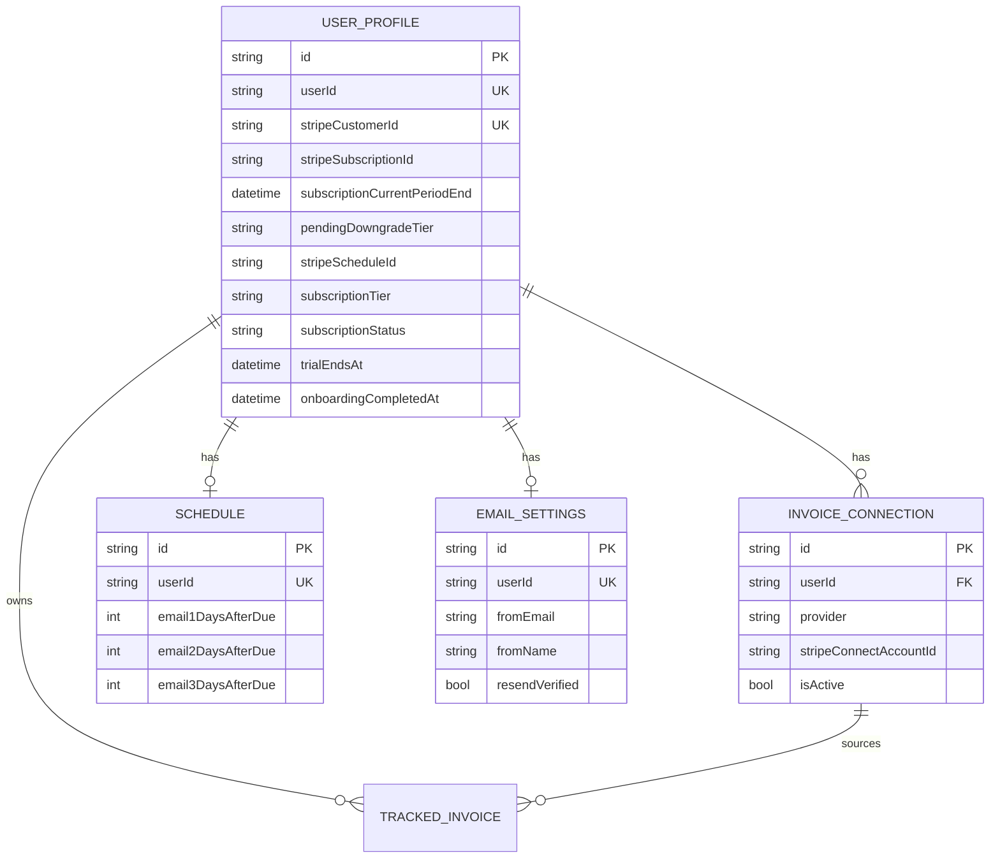
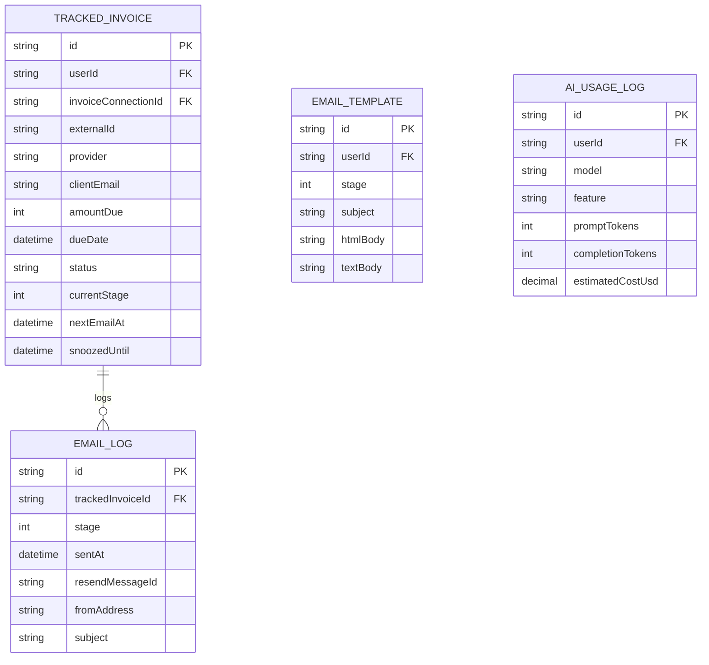
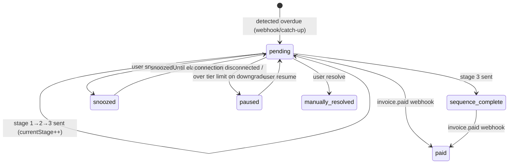

# Detailed Design Document — PaidSoon

> **Repository note.** The generation prompt targeted a `one-core` Django
> monorepo. **This repository is PaidSoon**, a single Next.js 16 (App Router)
> application. There are no Django apps, bounded contexts, vertical products,
> workflow engine, control library, or AI gateway. This document describes
> PaidSoon's actual implementation. Template sections without a code counterpart
> are marked **Not applicable to this repository**.

## 1. Purpose and Scope

This document describes the detailed implementation design of PaidSoon — a SaaS
app that automatically follows up on overdue invoices for freelancers. It is
derived from the current code, the OpenSpec change folders, and the operator
runbooks. It complements the high-level design in [HLD.md](HLD.md).

Scope: authentication and tenancy, the Stripe Connect invoice pipeline, the
three-stage email follow-up engine, subscription billing and entitlements,
data model, API surface, and runtime/infrastructure. Out of scope: anything not
present in the repository (it is documented as absent, not designed).

## 2. Source of Truth and Traceability

| Source | Path | Used for | Notes |
|---|---|---|---|
| Application code | `app/**`, `lib/**`, `middleware.ts` | Primary truth for all behaviour | App Router |
| Prisma schema | `prisma/schema.prisma` | Data model | 6 models |
| Initial migration | `prisma/migrations/20260531101711_init/migration.sql` | Tables, indexes, FKs | Single migration |
| RLS policies | `prisma/rls-policies.sql` | Tenant isolation | Applied manually in Supabase |
| Prisma config | `prisma.config.ts` | Two-URL migration/runtime split | `DIRECT_URL` vs `DATABASE_URL` |
| OpenSpec changes | `openspec/changes/**` | Spec intent + status | No `specs/` baseline dir |
| Runbooks | `docs/runbooks/**` | Env vars, deployment | Canonical env matrix |
| Tests | `tests/**` | Pure-logic unit tests | `node --test` + `tsx` |
| Scripts | `scripts/verify-rls.ts` | RLS verification | Proves isolation |
| Config | `package.json`, `next.config.ts`, `vercel.json`, `tsconfig.json` | Runtime/build | — |

## 3. Domain Model Overview

There is one bounded context: the freelancer's invoice-chasing domain. The table
below maps logical areas to code modules (there are no Django apps).

| Logical area | Module(s) | Purpose | Key models/services | OpenSpec |
|---|---|---|---|---|
| Auth & tenancy | `lib/supabase/**`, `lib/db/**`, `middleware.ts` | Identity, session, RLS scoping | `UserProfile`; `withUserContext`, `prismaAdmin` | `changes/invoice-nudge-mvp/specs/user-auth`, `changes/enforce-rls-via-prisma` |
| Invoice connection | `lib/providers/**`, `app/api/stripe/connect/**` | Link Stripe, abstract providers | `InvoiceConnection`; `InvoiceProvider` | `.../specs/invoice-connection` |
| Invoice tracking | `lib/email/catchup.ts`, `app/api/webhooks/stripe-connect/route.ts` | Detect/track overdue invoices | `TrackedInvoice` | `.../specs/invoice-tracking` |
| Follow-up engine | `app/api/cron/send-emails/route.ts`, `lib/email/**` | Stage progression + send | `TrackedInvoice`, `EmailLog`, `Schedule` | `.../specs/follow-up-sequences`, `.../specs/schedule-config` |
| Email identity | `app/api/settings/email/route.ts`, `lib/email/send.ts` | Custom verified sender | `EmailSettings` | `.../specs/email-settings`, `changes/rename-to-paidsoon` |
| Billing & entitlements | `app/api/billing/**`, `app/api/webhooks/stripe-billing/route.ts`, `lib/billing.ts`, `lib/subscriptionPlans.ts` | Plans, checkout, gating | `UserProfile.subscriptionTier`; `PLAN_CATALOG` | `changes/update-subscription-plan-tiers`, `.../specs/subscription-billing` |
| Dashboard & upsell | `app/dashboard/**`, `components/dashboard/**`, `lib/dashboardUpsell.ts` | Views + upgrade prompts | `DashboardUpsellModel` | `changes/sample-overdue-preview-upsell` |
| Live-mode gating | `lib/liveMode.ts`, `middleware.ts`, `app/layout.tsx` | Pre-launch lockout | — | `changes/live-mode-auth-gate-banner` |

## 4. Backend Application Design

There are no Django apps. The backend is route handlers + `lib` services. Each
subsection documents a functional module.

### 4.1 Auth & tenancy (`lib/db/**`, `lib/supabase/**`, `middleware.ts`)

- **Responsibility:** authenticate users, refresh sessions, enforce per-user DB
  isolation.
- **Key services:**
  - `createClient()` (`lib/supabase/server.ts`) — cookie-bound Supabase client
    for RSC/route handlers; `lib/supabase/client.ts` for the browser.
  - `withUserContext(userId, fn)` (`lib/db/withUserContext.ts`) — opens a Prisma
    `$transaction`, runs `SELECT set_config('request.jwt.claims', …, true)` and
    `SET LOCAL ROLE authenticated`, then runs `fn(tx)` so RLS applies.
  - `prismaAdmin` (`lib/db/admin.ts`) — singleton `PrismaClient` over
    `@prisma/adapter-pg` using `DATABASE_URL`; **bypasses RLS**; service paths
    only.
- **Permissions:** route handlers reject with 401 when `auth.getUser()` returns
  no user. `middleware.ts` redirects unauthenticated `/dashboard/*` to
  `/sign-in` and authenticated users away from auth pages.
- **Integration points:** Supabase Auth; Supabase Postgres.
- **Tests:** `scripts/verify-rls.ts` proves cross-user isolation (seed via
  `prismaAdmin`, read via `withUserContext`).

### 4.2 Invoice connection (`lib/providers/**`, `app/api/stripe/connect/**`)

- **Responsibility:** connect a user's Stripe account and normalise invoice data.
- **Key abstractions:** `InvoiceProvider` interface (`lib/providers/types.ts`)
  with methods `getOverdueInvoices`, `getInvoiceDetails`,
  `verifyWebhookSignature`, `parseWebhookEvent`. `getProvider(name)`
  (`lib/providers/index.ts`) resolves the registry (`stripe` only).
- **Stripe implementation:** `StripeInvoiceProvider` (`lib/providers/stripe.ts`)
  lists `status: "open"` invoices for a connected account and filters past-due;
  normalises to `NormalizedInvoice`.
- **Routes:**
  - `GET authorize` — checks connection-limit, redirects to Stripe OAuth with
    `state = user.id`.
  - `GET callback` — verifies `state == user.id`, exchanges code, enforces
    per-tier connection limit inside `withUserContext`, upserts
    `InvoiceConnection`.
  - `POST disconnect` — deactivates a connection and pauses its
    pending/snoozed invoices.
- **Integration points:** Stripe OAuth + Invoices API (per connected account via
  `{ stripeAccount }`).

### 4.3 Invoice tracking (`app/api/webhooks/stripe-connect/route.ts`, `lib/email/catchup.ts`)

- **Responsibility:** create `TrackedInvoice` rows for overdue invoices, mark
  paid.
- **Two ingestion paths:**
  1. **Webhook** (`stripe-connect`): verifies signature, handles
     `invoice.overdue` (create tracked invoice if under tier limit, idempotent)
     and `invoice.paid` (mark paid).
  2. **Catch-up scan** (`runCatchUpScan`): cron-time poll across all active
     Stripe connections, creating missing tracked invoices under tier limits.
- **Idempotency:** unique key `(externalId, provider, userId)` +
  pre-insert `findFirst` checks.
- **Tier limits:** `getInvoiceLimitForTier` gates how many active
  (`pending`/`snoozed`) invoices a user may track.

### 4.4 Follow-up engine (`app/api/cron/send-emails/route.ts`, `lib/email/**`)

- **Responsibility:** advance each tracked invoice through stages 1→3 and send.
- **Flow (cron GET):** auth via `Bearer CRON_SECRET` → `runCatchUpScan()` →
  resume snoozed invoices whose `snoozedUntil` elapsed → select `pending`
  invoices with `nextEmailAt <= now` and `currentStage < 3` → for each, resolve
  freelancer email/name via Supabase admin, `sendFollowUpEmail`, then advance
  `currentStage`/`nextEmailAt` or mark `sequence_complete` after stage 3.
- **Services:**
  - `sendFollowUpEmail` (`lib/email/send.ts`) — resolves from-address, renders
    template, sends via Resend, writes an `EmailLog`.
  - `resolveFromAddress` — uses custom verified sender when the tier has
    `own_email_address` and Resend is verified; else system domain.
  - `computeNextEmailAt` (`lib/email/schedule.ts`) — `dueDate + dayOffset`.
  - `renderTemplate` (`lib/email/templates.ts`) — stage 1/2/3 HTML+text.
- **Background tasks:** exactly one — this cron route. No queue/worker.

### 4.5 Email identity (`app/api/settings/email/route.ts`)

- **GET:** returns settings; if a custom `fromEmail` is set but unverified,
  polls `resend.domains.list()` and flips `resendVerified` when the sending
  domain reports `verified`.
- **PUT:** gated by `own_email_address`; upserts `EmailSettings`; on email
  change, triggers `resend.domains.create(...)` and resets verification.

### 4.6 Billing & entitlements (`app/api/billing/**`, `app/api/webhooks/stripe-billing/route.ts`, `lib/billing.ts`, `lib/subscriptionPlans.ts`)

- **Plan catalog:** `PLAN_CATALOG` defines `starter`/`solo`/`small_business`
  with `limits` (chased invoices, seats, connected accounts) and a
  `features` map. `LEGACY_TIER_MAP` maps `free→starter`, `pro→solo`.
- **Entitlement checks:** `requireFeature(userId, feature)` reads the tier via
  `withUserContext` and consults `hasPlanFeature`. Limit helpers:
  `getInvoiceLimitForTier`, `getStripeConnectionLimitForTier`,
  `getUserSeatLimitForTier`.
- **Checkout:** `POST checkout` maps requested tier → price id env var, creates
  (or reuses) a Stripe customer, returns a Checkout session URL.
- **Portal:** `POST portal` returns a Stripe billing-portal URL.
- **Webhook (`stripe-billing`):** signature-verified; handles
  `checkout.session.completed` (set tier/active), `customer.subscription.updated`
  (resolve tier from price id), `customer.subscription.deleted` (revert to
  `starter`, pause invoices over the starter limit). **`invoice.payment_failed`
  is not handled** (proposed in `changes/handle-billing-payment-failed-webhook`).

### 4.7 Dashboard actions (`app/api/invoices/[id]/**`)

- `pause`, `resume`, `snooze` (7-day), `resolve` (`manually_resolved`). All run
  inside `withUserContext` and re-check ownership via `findFirst` with
  `userId: user.id`, returning 404 when not found/ineligible.

### 4.8 Settings (templates / AI / team)

- `settings/templates` — GET returns the saved or default template for a stage
  (gated by `basic_templates`); PUT is gated by `custom_reminder_templates` and
  persists to the `email_templates` table via `withUserContext`; DELETE resets a
  stage to the system default.
- `settings/ai` — GET reports `canRewrite`; POST accepts `{ text, stage }`,
  calls GPT-4o-mini via the Vercel AI SDK (`lib/email/ai-rewrite.ts`), and
  returns three tone variants (`friendly`, `firm`, `final_notice`). Token usage
  and estimated cost are written to `ai_usage_logs` via `prismaAdmin`
  (documented RLS bypass: token counts are only available after the call).
  **There is no standalone AI settings page** — AI controls are embedded in the
  Templates settings page (`app/dashboard/settings/templates`).
- `settings/team/invite` — GET reports seats; POST validates email and seat
  limit but **does not persist** (no membership model).

### 4.9 Not applicable

Compliance/control-library, workflow engine, CMS, vertical_setup, RTO,
integrations registry, and any `apps/api/apps/**` modules — **not present**.

## 5. Frontend Application Design

| Concern | Path(s) | Notes |
|---|---|---|
| Root layout + LIVE banner | `app/layout.tsx` | Renders not-live banner when `LIVE` is falsey |
| Landing page | `app/page.tsx` | Hero, "How it works" (templates/AI items with `*` higher-plan markers), pricing, footer |
| Auth pages | `app/(auth)/sign-in/page.tsx`, `app/(auth)/sign-up/page.tsx` | Client components; email/pw + Google OAuth; `Spinner` loading state |
| Auth callback | `app/auth/callback/route.ts` | `exchangeCodeForSession` → `/dashboard` |
| Sign out | `app/auth/sign-out/route.ts` | `signOut()` → redirect `/` |
| Trial checkout gateway | `app/billing/checkout/page.tsx` | Server component; reads `?plan` param (falls back to profile tier), POSTs to `/api/billing/checkout`, and redirects to the Stripe Checkout URL. Entry point for both the trial-expired gate and the TrialBanner "Add payment" CTA. Renders an error UI if checkout session creation fails. |
| Dashboard shell | `app/dashboard/layout.tsx` | Nav with `UserMenu` dropdown (identity + sign-out); redirects unauthenticated to `/sign-in` |
| Dashboard page | `app/dashboard/page.tsx` | Overdue/resolved tables; feature-gated modules + upsell |
| Settings pages | `app/dashboard/settings/{account,schedule,email,templates,team,stripe,subscription}/page.tsx` | Each pairs with a `*Client.tsx`; AI controls are embedded in the templates page |
| Dashboard components | `components/dashboard/{InvoiceTable,LockedDashboardPreview,UpgradeBanner}.tsx` | Table + locked preview + banner |
| Settings clients | `components/settings/*Client.tsx` | Client-side forms calling the settings APIs |
| Shared UI | `components/ui/Spinner.tsx` | Only shared primitive |
| API clients | (none) | Components call route handlers via `fetch`; Supabase via `@supabase/ssr` |
| Env config | `process.env.NEXT_PUBLIC_*` | Supabase URL/key, `NEXT_PUBLIC_APP_URL` |

- **Auth/session logic:** browser client (`lib/supabase/client.ts`) for sign-in;
  server client (`lib/supabase/server.ts`) for RSC/route handlers; refresh in
  `middleware.ts`.
- **Tenant context:** implicit `user.id`; no tenant switcher.
- **RBAC helpers:** none; only `hasPlanFeature`/`requireFeature` entitlement
  gates.
- **Vertical-specific pages:** none.

## 6. Database Design

Eight application tables, all owned by a single user (tenant = `userId`). All
FKs reference `user_profiles.userId` (or parent rows) with `ON DELETE RESTRICT`.

### 6.1 Tenancy / profile / connections / config



### 6.2 Invoice tracking / email log



`USER_PROFILE ||--o{ EMAIL_TEMPLATE : has`
`USER_PROFILE ||--o{ AI_USAGE_LOG : logs`

### 6.3 Model reference

| Model | Path | Purpose | Key fields | Relationships | Tenant scoped? | Notes |
|---|---|---|---|---|---|---|
| `UserProfile` | `prisma/schema.prisma` | Per-user billing/sub state | `userId` (UK), `stripeCustomerId` (UK), `stripeSubscriptionId`, `subscriptionCurrentPeriodEnd`, `pendingDowngradeTier`, `stripeScheduleId`, `subscriptionTier`, `subscriptionStatus`, `trialEndsAt`, `onboardingCompletedAt`, `displayName` | 1—N connections/invoices; 1—1 schedule/email settings | Yes (RLS) | New users start with `subscriptionStatus: "trialing"` and `trialEndsAt: now + 14 days`; `onboardingCompletedAt` is null until plan is chosen on `/onboarding`; `displayName` is used as `{{yourName}}` in reminder emails |
| `InvoiceConnection` | `prisma/schema.prisma` | Linked Stripe account | `provider`, `stripeConnectAccountId`, `isActive` | N—1 profile; 1—N invoices | Yes | Comment claims app-layer encryption (not implemented) |
| `Schedule` | `prisma/schema.prisma` | Day offsets for stages | `email{1,2,3}DaysAfterDue` | 1—1 profile | Yes | Defaults 3/10/21 |
| `EmailSettings` | `prisma/schema.prisma` | Custom verified sender | `fromEmail`, `fromName`, `replyTo`, `resendVerified` | 1—1 profile | Yes | Used when tier has `own_email_address` |
| `TrackedInvoice` | `prisma/schema.prisma` | Overdue invoice being chased | `externalId`, `status`, `currentStage`, `nextEmailAt`, `snoozedUntil` | N—1 profile/connection; 1—N logs | Yes | Unique `(externalId, provider, userId)` |
| `EmailLog` | `prisma/schema.prisma` | Per-send record | `stage`, `resendMessageId`, `fromAddress`, `subject` | N—1 tracked invoice | Yes (via join policy) | Insert via service role |
| `EmailTemplate` | `prisma/schema.prisma` | Per-user custom stage template | `userId`, `stage` (1–3), `subject`, `htmlBody`, `textBody` | N—1 profile | Yes | Unique `(userId, stage)`; upserted by templates PUT; deleted by templates DELETE |
| `AiUsageLog` | `prisma/schema.prisma` | AI token usage + cost record | `userId`, `model`, `feature`, `promptTokens`, `completionTokens`, `estimatedCostUsd` | N—1 profile | Yes (SELECT only; INSERT via `prismaAdmin`) | Written after each GPT-4o-mini rewrite call |

> ERDs for RBAC, compliance/controls/obligations/evidence, workflow,
> integrations registry, audit, AI policy, and vertical models are **not
> applicable** — no such tables exist.

### 6.4 RLS design

`prisma/rls-policies.sql` enables RLS on all eight tables. Policies key on
`auth.uid()::text = "userId"` for SELECT/INSERT/UPDATE. `email_templates` has a
DELETE policy (users reset a stage to defaults). Other tables have no DELETE
policy (app never hard-deletes rows; FKs are `RESTRICT`). `email_logs` SELECT
and INSERT both use a join-based `EXISTS` check against `tracked_invoices`
(ownership via `userId`); the cron worker bypasses RLS entirely via `prismaAdmin`
(service role), so the tightened INSERT policy does not affect it. `ai_usage_logs`
has a SELECT policy for own rows; INSERTs are `prismaAdmin`-only (no user INSERT
policy).

## 7. API Design

| Route | Handler | Validation | Permission | Tenant scoping | Request → Response | Status |
|---|---|---|---|---|---|---|
| `PATCH /api/onboarding` | `app/api/onboarding/route.ts` | `zod` `{tier}` | session | `withUserContext` profile | `{tier}` → `{ok}` | Implemented |
| `POST /api/billing/checkout` | `app/api/billing/checkout/route.ts` | `zod` `{tier?}` | session | `withUserContext` profile | `{tier}` → `{url}` | Implemented |
| `POST /api/billing/portal` | `app/api/billing/portal/route.ts` | — | session | `withUserContext` | `{}` → `{url}` | Implemented |
| `GET /api/stripe/connect/authorize` | `.../authorize/route.ts` | — | session | `withUserContext` count | → redirect to Stripe | Implemented |
| `GET /api/stripe/connect/callback` | `.../callback/route.ts` | query `code,state` | session + `state==user.id` | `withUserContext` upsert | → redirect to settings | Implemented |
| `POST /api/stripe/connect/disconnect` | `.../disconnect/route.ts` | optional `{connectionId}` | session | `withUserContext` | → `{success}` | Implemented |
| `POST /api/webhooks/stripe-billing` | `.../stripe-billing/route.ts` | Stripe signature | signature | `prismaAdmin` by `stripeCustomerId` | Stripe event → `{received}` | Implemented (no `payment_failed`) |
| `POST /api/webhooks/stripe-connect` | `.../stripe-connect/route.ts` | provider signature | signature | `prismaAdmin` by account id | Stripe event → `{received}` | Implemented |
| `GET /api/cron/send-emails` | `.../cron/send-emails/route.ts` | — | `Bearer CRON_SECRET` | `prismaAdmin` | → `{emailsSent,errors,processed}` | Implemented |
| `POST /api/invoices/[id]/pause` | `.../pause/route.ts` | path `id` | session | `withUserContext` | → `{success}` | Implemented |
| `POST /api/invoices/[id]/resume` | `.../resume/route.ts` | path `id` | session | `withUserContext` | → `{success}` | Implemented |
| `POST /api/invoices/[id]/snooze` | `.../snooze/route.ts` | path `id` | session | `withUserContext` | → `{success,snoozedUntil}` | Implemented |
| `POST /api/invoices/[id]/resolve` | `.../resolve/route.ts` | path `id` | session | `withUserContext` | → `{success}` | Implemented |
| `GET/PUT /api/settings/schedule` | `.../schedule/route.ts` | `zod` ascending offsets | session + `email_reminder_sequence` | `withUserContext` upsert | → `{schedule}` / `{success}` | Implemented |
| `GET/PUT /api/settings/email` | `.../email/route.ts` | `zod` email/name | session + `own_email_address` (PUT) | `withUserContext` | → `{settings}` / `{success}` | Implemented |
| `PATCH /api/settings/profile` | `.../profile/route.ts` | `zod` `{displayName}` 1–100 chars | session | `withUserContext` profile update | → `{displayName}` | Implemented |
| `GET/PUT/DELETE /api/settings/templates` | `.../templates/route.ts` | `zod` subject/body | session + template features | `withUserContext` (PUT/DELETE) | → `{...template}` / `{success}` | Implemented |
| `GET/POST /api/settings/ai` | `.../ai/route.ts` | `zod` text/stage | session + `ai_rewrite` | `prismaAdmin` (`ai_usage_logs`) | → `{canRewrite}` / `{success, friendly, firm, final_notice}` | Implemented (GPT-4o-mini) |
| `POST /api/billing/downgrade` | `app/api/billing/downgrade/route.ts` | `zod` `{tier}` | session | `withUserContext` profile | `{tier}` → `{scheduledAt}` | Implemented |
| `DELETE /api/billing/downgrade` | `app/api/billing/downgrade/route.ts` | — | session | `withUserContext` profile | → `{cancelled}` | Implemented |
| `GET/POST /api/settings/team/invite` | `.../team/invite/route.ts` | `zod` email | session | (none) | → seats / `{success}` | **Scaffold (not persisted)** |

Canonical vs deprecated: there are no deprecated API aliases. The only
backward-compat artifact is `STRIPE_PRO_PRICE_ID` accepted as a `solo` fallback.

## 8. Authentication, Authorization and Tenancy

- **Auth provider:** Supabase Auth (email/password + Google OAuth). Browser
  sign-in uses `supabase.auth.signInWithPassword` / `signInWithOAuth`
  (`app/(auth)/sign-in/page.tsx`). OAuth returns to `app/auth/callback/route.ts`
  which calls `exchangeCodeForSession`.
- **Session model:** Supabase session cookies bridged by `@supabase/ssr`.
  `middleware.ts` calls `supabase.auth.getUser()` to refresh and to guard
  `/dashboard/*`.
- **Backend auth:** every user-facing route handler calls
  `supabase.auth.getUser()` and returns 401 when absent. Webhooks use Stripe
  signatures; cron uses `CRON_SECRET`.
- **Authorization model:** **plan-tier entitlements only** — there are no roles,
  no org/workspace/tenant role hierarchy, no impersonation. `requireFeature`
  and limit helpers in `lib/billing.ts` are the entire authorization surface.
- **Tenant resolution:** the authenticated `user.id` → `withUserContext` sets
  `request.jwt.claims.sub` and `SET LOCAL ROLE authenticated`, so
  `auth.uid()` resolves to that user and RLS scopes every query in the
  transaction.
- **Cross-tenant enforcement:** Postgres RLS policies; `scripts/verify-rls.ts`
  proves user A cannot read user B's rows even with the `where` clause omitted.

```mermaid
sequenceDiagram
    participant U as Browser
    participant MW as middleware.ts
    participant RH as Route handler
    participant WC as withUserContext
    participant PG as Postgres (RLS)

    U->>MW: GET /dashboard (session cookie)
    MW->>MW: supabase.auth.getUser()
    alt no user
        MW-->>U: 302 /sign-in
    else authenticated
        MW-->>RH: forward request
        RH->>RH: supabase.auth.getUser() → user.id
        RH->>WC: withUserContext(user.id, fn)
        WC->>PG: BEGIN; set_config(jwt.claims); SET LOCAL ROLE authenticated
        WC->>PG: SELECT ... (RLS scoped to auth.uid())
        PG-->>WC: only this user's rows
        WC-->>RH: result
        RH-->>U: rendered page / JSON
    end
```

## 9. Compliance and Evidence Design

**Not applicable to this repository.** PaidSoon is not a compliance product.
There are no standards, obligations, controls, control templates, evidence
items, evaluation events, or compliance exports. The closest analogue to an
"evidence trail" is the `email_logs` table recording each reminder sent.

## 10. Workflow Engine Design

**No general workflow engine exists.** The only stateful "workflow" is the
three-stage email follow-up sequence implemented procedurally in
`app/api/cron/send-emails/route.ts`. There are no workflow definitions,
versions, instances, nodes, tasks, approvals, decision nodes, or SLA handling.

State transitions of a `TrackedInvoice`:



- **Notification hook:** sending an email writes an `EmailLog` and advances
  `currentStage`/`nextEmailAt`.
- **Background worker:** the single daily cron route; no queue.

## 11. Billing and Entitlements Design

- **Plans** (`lib/subscriptionPlans.ts`):

| Tier | Price/mo | Chased invoices | Seats | Stripe accounts | Notable features |
|---|---|---|---|---|---|
| `starter` | A$9 | 10 | 1 | 1 | basic reminders, branding |
| `solo` | A$19 | 30 | 1 | 1 | sequence, basic templates, own email, payment+overdue dashboards |
| `small_business` | A$39 | 100 | 3 | 3 | + custom templates, AI rewrite, tone settings |

- **Features** are a `Record<SubscriptionFeature, boolean>` per plan; checked via
  `hasPlanFeature`/`requireFeature`.
- **Legacy mapping:** `free→starter`, `pro→solo` via `LEGACY_TIER_MAP` +
  `normalizeSubscriptionTier`.
- **Checkout → activation:** `POST /api/billing/checkout` → Stripe Checkout →
  `checkout.session.completed` webhook sets `subscriptionTier` (from
  `selectedTier` metadata) and `subscriptionStatus = active`.
- **Updates/cancellation:** `customer.subscription.updated` resolves tier from
  the price id (`PRICE_ID_TO_TIER`); `customer.subscription.deleted` reverts to
  `starter`, sets `cancelled`, and pauses invoices exceeding the starter limit.
- **Portal:** `POST /api/billing/portal` → Stripe billing portal.
- **Trial/free handling:** `trialing` is treated as active; there is no separate
  free plan — `starter` is the paid entry tier (schema's `"free"` default maps
  to `starter`).
- **Not implemented:** `invoice.payment_failed` → `past_due`
  (`changes/handle-billing-payment-failed-webhook`); add-ons; usage events.

## 12. AI Rewrite Design

`app/api/settings/ai/route.ts` gates on the `ai_rewrite` plan feature
(`small_business` tier only).

**GET** returns `{ canRewrite: boolean }`.

**POST** accepts `{ text, stage: 1|2|3 }` and calls GPT-4o-mini via the Vercel
AI SDK (`lib/email/ai-rewrite.ts`). The model produces three tone variants —
`friendly`, `firm`, and `final_notice` — each with a rewritten `subject` and
`message`. A stage-specific prompt prefix guides tone (stage 1 = friendly;
stage 2 = professional + urgent; stage 3 = direct + firm deadline). After a
successful call, token counts and estimated cost (USD) are written to
`ai_usage_logs` via `prismaAdmin` (documented RLS bypass: token counts are only
available after the call completes, outside any user-context transaction).

**UI integration:** the AI Rewrite button lives in the Templates settings page
(`app/dashboard/settings/templates`). The standalone `/dashboard/settings/ai`
page was removed as part of `changes/ai-message-rewrite`.

**No AI gateway abstraction** — one hardcoded `gpt-4o-mini` model call via
`@ai-sdk/openai`. No allowed-model registry, no budget enforcement, no
RAG/vector store, no LLM fallback.

## 13. Notifications and Messaging Design

- **Provider:** Resend (`lib/email/send.ts`).
- **No notification model** — emails are the only notification channel; there is
  no in-app notification table or user notification preferences (beyond the
  custom-sender `EmailSettings`).
- **Delivery path:** cron → `sendFollowUpEmail` → `resend.emails.send` →
  `EmailLog` insert. From-address resolved by tier + Resend verification.
- **Retry/error handling:** send failures are caught, logged via
  `console.error`, counted as `errors` in the cron response, and `null` is
  returned (no `EmailLog` written, stage not advanced). There is **no automatic
  retry/backoff** — the next daily cron re-attempts because the stage did not
  advance.
- **Webhooks:** inbound Stripe webhooks (not outbound notifications).

## 14. Integrations Design

- **No integration registry/model.** Integrations are hardcoded providers:
  - **Stripe Connect** — read invoices (`lib/providers/stripe.ts`).
  - **Stripe Billing** — subscriptions/portal (`app/api/billing/**`).
  - **Resend** — email + domain verification.
  - **Supabase** — auth + DB.
- **Connectivity probes:** none, except the implicit Resend domain-status poll in
  the email settings GET.
- **MYOB / other integrations:** not present (the provider interface allows
  future sources, but only `stripe` is registered).
- **Error handling:** webhook signature failures → 400; provider list/retrieve
  failures are caught and skipped.

## 15. Reporting, Audit and Export Design

- **Audit model:** none. `email_logs` is the only persistent event record.
- **Reporting views:** the dashboard's "resolved" view (`?resolved=1`) is the
  only reporting surface, gated by `payment_status_dashboard`.
- **Export pipeline / evidence export / retention:** none implemented or
  specified.

## 16. Vertical Product Design

**Not applicable to this repository.** PaidSoon is a single product with a single
brand (`app/layout.tsx`, `changes/rename-to-paidsoon`). There is no shared core
vs vertical-module split, no per-hostname/domain separation, no vertical
setup/admin, and no ISOComply/RTOComply/StrataComply/NDISComply code or seed
data. The legacy brand "Invoice Nudge" / `invoicenudge.com` is being retired in
favour of "PaidSoon" / `paidsoon.com`.

## 17. Infrastructure Runtime Design

| Concern | Design | Evidence |
|---|---|---|
| Local dev | `npm install` → `vercel env pull .env.local` → `npm run dev` | `README.md` |
| Build | `prisma generate && next build` | `package.json` |
| API/web runtime | Single Next.js 16 app on Vercel | `docs/runbooks/vercel.md` |
| Worker runtime | None — cron route on same deployment | `vercel.json` |
| Scheduler | Vercel Cron `0 9 * * *` (prod only) → `/api/cron/send-emails` | `vercel.json`, `docs/runbooks/vercel.md` |
| Database | Supabase Postgres; runtime via pooled `authenticator` role | `prisma.config.ts`, `lib/db/admin.ts` |
| Migrations | `prisma migrate` via `DIRECT_URL` (owner) | `prisma.config.ts` |
| RLS bootstrap | `prisma/rls-policies.sql` applied manually in Supabase | `prisma/rls-policies.sql`, `docs/runbooks/supabase.md` |
| Object storage / Redis | None | — |
| Email | Resend | `docs/runbooks/resend.md` |
| Secrets / env | Vercel env + `.env.local`; canonical matrix | `docs/runbooks/README.md` |
| CI workflows | **None** (`.github/` has only `prompts/` + `skills/`, no `workflows/`) | (file tree) |
| Deploy workflows | Vercel Git integration (no repo workflow files) | `docs/runbooks/vercel.md` |
| Docker Compose | **None** | — |

> **Explicitly not present:** AWS App Runner, RDS Multi-AZ, SES, Cognito,
> Terraform, Docker, Redis. The system runs entirely on Vercel + Supabase +
> Stripe + Resend.

### Environment variables (consumed in code)

The exhaustive, code-checked list lives in `docs/runbooks/README.md`
("Where each var is consumed in code"). Key ones:
`NEXT_PUBLIC_SUPABASE_URL`, `NEXT_PUBLIC_SUPABASE_PUBLISHABLE_KEY`,
`SUPABASE_SECRET_KEY`, `DATABASE_URL`, `DIRECT_URL`, `NEXT_PUBLIC_APP_URL`,
`LIVE`, `CRON_SECRET`, `STRIPE_SECRET_KEY`,
`STRIPE_{STARTER,SOLO,SMALL_BUSINESS,PRO}_PRICE_ID`,
`STRIPE_CONNECT_CLIENT_ID`, `STRIPE_BILLING_WEBHOOK_SECRET`,
`STRIPE_CONNECT_WEBHOOK_SECRET`, `RESEND_API_KEY`, `RESEND_FROM_EMAIL`,
`RESEND_FROM_NAME`.

## 18. Testing Strategy

| Layer | Tooling | Coverage | Status |
|---|---|---|---|
| Unit (pure logic) | `node --test` + `tsx` (`npm test`) | `tests/live-mode.test.ts`, `tests/subscription-plans.test.ts`, `tests/dashboard-upsell.test.ts` | Implemented |
| RLS isolation | `scripts/verify-rls.ts` (`npm run verify-rls`) | Cross-user isolation proof | Implemented |
| Type checks | `tsc` via `next build` | Whole app | Implemented |
| Lint | `eslint` (`npm run lint`, `eslint-config-next`) | Whole app | Implemented |
| CI gates | **None** — no `.github/workflows` | — | **Gap** |
| Integration / E2E | None in repo (manual E2E checklist in `changes/go-live-runbook`) | — | **Gap** |
| Performance/Locust | None | — | N/A |
| OpenSpec validation | OpenSpec CLI exists conceptually (`openspec/config.yaml`); no CI hook | — | Gap |

**Coverage gaps:** route handlers, webhooks, and the cron engine have no
automated tests; only pure helpers are unit-tested.

## 19. Security and Privacy Detailed Design

- **Tenant isolation:** RLS via `withUserContext` (§8); verified by script.
- **Service-role escalation:** `prismaAdmin` bypasses RLS; restricted by
  convention to cron, webhooks, and post-signup bootstrap
  (`lib/actions/auth.ts`); imports are grep-able by design.
- **Data access controls:** RLS policies on all eight tables; `email_templates`
  has a DELETE policy (users reset a stage to defaults); other tables have no
  DELETE policy (FKs `RESTRICT`).
- **Storage access controls:** N/A (no object storage).
- **Encryption:** delegated to managed platforms. **Gap:**
  `stripeConnectAccountId` is documented as app-encrypted but stored in plaintext
  (`app/api/stripe/connect/callback/route.ts`).
- **Secrets:** environment variables only; no secrets manager.
- **Webhook/cron auth:** Stripe signatures; `CRON_SECRET` bearer.
- **OAuth CSRF:** Stripe Connect `state == user.id` check.
- **AI governance:** `ai_usage_logs` records model name, feature, token counts,
  and estimated cost per call; gated to `small_business` tier via
  `requireFeature`.
- **PII handling:** client name/email and invoice amounts are stored; **no
  documented retention, minimisation, or deletion** policy. RLS prevents
  cross-tenant exposure.
- **Admin access / impersonation:** none in app; operators use external
  consoles.
- **Rate limiting / abuse protection:** **none in code** — gap.

## 20. Operational Runbooks and Support

| Area | Where | Notes |
|---|---|---|
| Runbooks | `docs/runbooks/{README,supabase,stripe,resend,vercel}.md` | README holds the canonical env matrix + execution order |
| Health checks | None | No `/health` route |
| Local startup | `README.md` quick reference | `vercel env pull` then `npm run dev` |
| Migration process | `prisma migrate` via `DIRECT_URL`; RLS SQL applied manually | `prisma.config.ts`, `docs/runbooks/supabase.md` |
| Backup/restore | Supabase managed (not documented in repo) | Assumed |
| Cron testing | Manual `curl` with `CRON_SECRET` (prod-only schedule) | `docs/runbooks/vercel.md` |
| Go-live | Ordered operator checklist | `changes/go-live-runbook/proposal.md` |
| Support/helpdesk | None integrated | Gap |
| Incident response | Not documented | Gap |

## 21. Implementation Status Matrix

| Capability | Implemented in code? | OpenSpec status | Key code paths | Key spec paths | Notes |
|---|---|---|---|---|---|
| User auth | Yes | Specified | `app/(auth)/**`, `lib/supabase/**` | `changes/invoice-nudge-mvp/specs/user-auth` | Email/pw + Google |
| RLS tenant isolation | Yes | Specified | `lib/db/withUserContext.ts`, `prisma/rls-policies.sql` | `changes/enforce-rls-via-prisma` | Verified by script |
| Invoice connection | Yes | Specified | `app/api/stripe/connect/**`, `lib/providers/**` | `.../invoice-connection` | Stripe only |
| Invoice tracking | Yes | Specified | `lib/email/catchup.ts`, `.../webhooks/stripe-connect` | `.../invoice-tracking` | Webhook + catch-up |
| Follow-up sequences | Yes | Specified | `app/api/cron/send-emails/route.ts`, `lib/email/**` | `.../follow-up-sequences` | 3 stages |
| Schedule config | Yes | Specified | `app/api/settings/schedule/route.ts` | `.../schedule-config` | Ascending offsets |
| Email settings | Yes | Specified | `app/api/settings/email/route.ts` | `.../email-settings` | Resend verify poll |
| Manual actions | Yes | Specified | `app/api/invoices/[id]/**` | `.../dashboard` | pause/resume/snooze/resolve |
| Dashboard + upsell | Yes | Specified | `app/dashboard/page.tsx`, `lib/dashboardUpsell.ts` | `changes/sample-overdue-preview-upsell` | Gated modules |
| Billing tiers | Yes | Specified | `lib/subscriptionPlans.ts`, `app/api/billing/**` | `changes/update-subscription-plan-tiers` | 3 tiers |
| Live-mode gating | Yes | Specified | `lib/liveMode.ts`, `middleware.ts` | `changes/live-mode-auth-gate-banner` | `LIVE` flag |
| Login spinner | Yes | Specified | `components/ui/Spinner.tsx`, `app/(auth)/**` | `changes/login-loading-spinner` | — |
| Logout redirect | Yes | Specified | `app/auth/sign-out/route.ts` | `changes/logout-redirect-homepage` | → `/` |
| Rename to PaidSoon | Yes | Specified | `app/layout.tsx`, `lib/email/send.ts` | `changes/rename-to-paidsoon` | Brand flip |
| How-it-works gating | Yes | Specified | `app/page.tsx` | `changes/expand-how-it-works-with-plan-gated-features` | Tasks all checked |
| Environment runbooks | Yes (docs) | Specified | `docs/runbooks/**` | `changes/build-environment-runbooks` | Replaces old SETUP/GO-LIVE |
| Basic templates | Yes | Specified | `app/api/settings/templates/route.ts` | `changes/ai-message-rewrite`, `changes/templates-sidebar-help` | GET/PUT/DELETE; persists to `email_templates`; sidebar with variable chips |
| Custom templates | Yes | Specified | `app/api/settings/templates/route.ts` | `changes/ai-message-rewrite` | Persisted via `withUserContext`; gated to `small_business` |
| AI rewrite | Yes | Specified | `app/api/settings/ai/route.ts`, `lib/email/ai-rewrite.ts` | `changes/ai-message-rewrite` | GPT-4o-mini; usage logged; UI embedded in templates page |
| Subscription plan switching | Yes | Specified | `app/api/billing/{checkout,downgrade}/route.ts` | `changes/subscription-plan-switching` | Upgrade mid-cycle; deferred downgrade via Stripe Schedule |
| Team seats / invites | Partially implemented | Not specified | `app/api/settings/team/invite/route.ts` | — | No persistence |
| `invoice.payment_failed` | No | Proposed | (`app/api/webhooks/stripe-billing/route.ts`) | `changes/handle-billing-payment-failed-webhook` | Not in code |
| Env-var drift CI check | No | Proposed | (`scripts/check-runbook-envvars.ts`) | `changes/ci-runbook-envvar-drift-check` | No CI at all |
| Go-live execution | N/A (ops) | Proposed (ops runbook) | — | `changes/go-live-runbook` | Operator actions |
| Organisations/RBAC/workflow/compliance/AI gateway/verticals | No | Not specified | — | — | Not this product |

## 22. Known Gaps and Follow-Up Work

**Documentation gaps**
- No `docs/adr/**`; architectural decisions live informally in OpenSpec
  `design.md` files.
- Backup/restore, incident response, and DR are undocumented.

**OpenSpec gaps**
- No `openspec/specs/**` baseline — specs only exist inside change folders and
  are never archived, so "current spec" is hard to read.
- Templates, AI rewrite, and team seats are implemented (as scaffolds) without
  any OpenSpec coverage.

**Code gaps**
- `invoice.payment_failed` handler missing (proposed).
- Team invites are a non-functional scaffold (no membership model or persistence).
- Cron `send-emails` loops sequentially over all due invoices with no
  pagination/batching — a scaling risk.

**Test gaps**
- No tests for route handlers, webhooks, or the cron engine.
- No CI pipeline to run `lint`/`test`/`build`/`verify-rls` automatically.

**Security gaps**
- `stripeConnectAccountId` plaintext despite "encrypted at app layer" comment.
- No rate limiting / abuse protection.
- No PII retention/deletion policy.

**Operational gaps**
- No health-check endpoint.
- No structured logging/observability.
- No support/helpdesk integration.

## 23. Appendix A — Code Path Index

**Auth & tenancy**
- `lib/supabase/server.ts`, `lib/supabase/client.ts`, `middleware.ts`
- `lib/db/withUserContext.ts`, `lib/db/admin.ts`, `lib/actions/auth.ts`
- `app/(auth)/sign-in/page.tsx`, `app/(auth)/sign-up/page.tsx`,
  `app/auth/callback/route.ts`, `app/auth/sign-out/route.ts`

**Invoice pipeline**
- `lib/providers/types.ts`, `lib/providers/stripe.ts`, `lib/providers/index.ts`
- `app/api/stripe/connect/{authorize,callback,disconnect}/route.ts`
- `app/api/webhooks/stripe-connect/route.ts`, `lib/email/catchup.ts`

**Follow-up engine**
- `app/api/cron/send-emails/route.ts`
- `lib/email/{send,schedule,templates}.ts`
- `app/api/invoices/[id]/{pause,resume,snooze,resolve}/route.ts`

**Billing & entitlements**
- `lib/subscriptionPlans.ts`, `lib/billing.ts`
- `app/api/billing/{checkout,portal}/route.ts`
- `app/api/webhooks/stripe-billing/route.ts`

**Dashboard & settings**
- `app/dashboard/{layout,page}.tsx`, `app/dashboard/settings/**`
- `components/dashboard/**`, `components/settings/**`,
  `lib/dashboardUpsell.ts`

**Platform/config**
- `app/layout.tsx`, `lib/liveMode.ts`
- `prisma/schema.prisma`, `prisma/rls-policies.sql`, `prisma.config.ts`
- `vercel.json`, `next.config.ts`, `scripts/verify-rls.ts`

## 24. Appendix B — OpenSpec Index

**Implemented changes (code confirms):** `invoice-nudge-mvp`,
`enforce-rls-via-prisma`, `update-subscription-plan-tiers`, `rename-to-paidsoon`,
`live-mode-auth-gate-banner`, `login-loading-spinner`, `logout-redirect-homepage`,
`sample-overdue-preview-upsell`, `build-environment-runbooks`,
`expand-how-it-works-with-plan-gated-features`, `signup-trial-onboarding`,
`email-settings-field-hints`, `templates-sidebar-help`, `ai-message-rewrite`,
`subscription-plan-switching`.

**Proposed / not implemented:** `handle-billing-payment-failed-webhook`
(no `invoice.payment_failed` case in code), `ci-runbook-envvar-drift-check`
(no script, no CI).

**Operator runbook (no code):** `go-live-runbook`.

Delta specs live under `openspec/changes/<change>/specs/<capability>/spec.md`.
There is no `openspec/specs/**` baseline directory.

## 25. Appendix C — Glossary

| Term | Meaning |
|---|---|
| Tenant | A single user, keyed by Supabase `auth.users.id`; the isolation boundary |
| RLS | Postgres Row Level Security |
| `withUserContext` | RLS-enforcing Prisma transaction wrapper (`lib/db/withUserContext.ts`) |
| `prismaAdmin` | RLS-bypassing Prisma client for service paths (`lib/db/admin.ts`) |
| Tracked invoice | `TrackedInvoice` row for an overdue invoice being chased |
| Stage | Reminder step 1 (friendly) → 2 (firm) → 3 (final) |
| Catch-up scan | Cron-time Stripe poll for newly overdue invoices (`lib/email/catchup.ts`) |
| Connection | Linked Stripe Connect account (`InvoiceConnection`) |
| Tier / plan | Subscription level gating features and limits |
| Entitlement | A boolean plan feature checked via `requireFeature`/`hasPlanFeature` |
| `LIVE` | Env flag gating auth entry pre-launch (`lib/liveMode.ts`) |
| Provider | Invoice-source adapter implementing `InvoiceProvider` |
