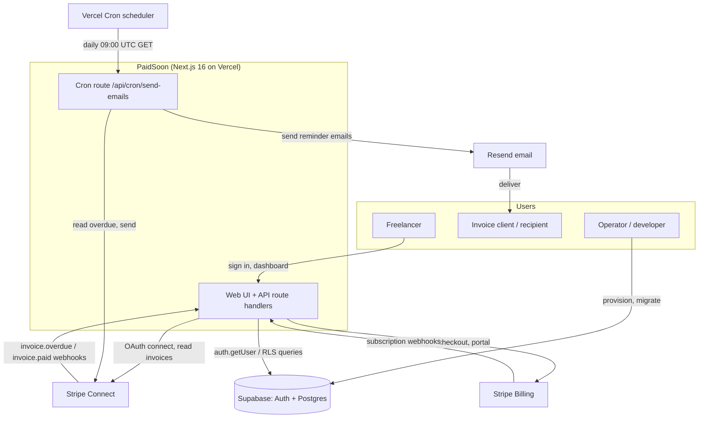
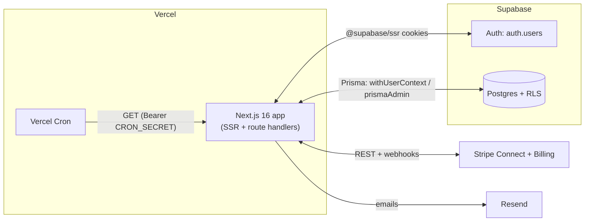
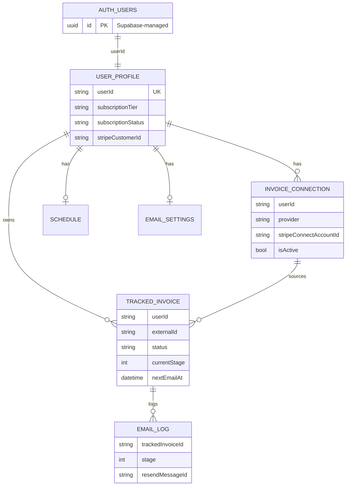
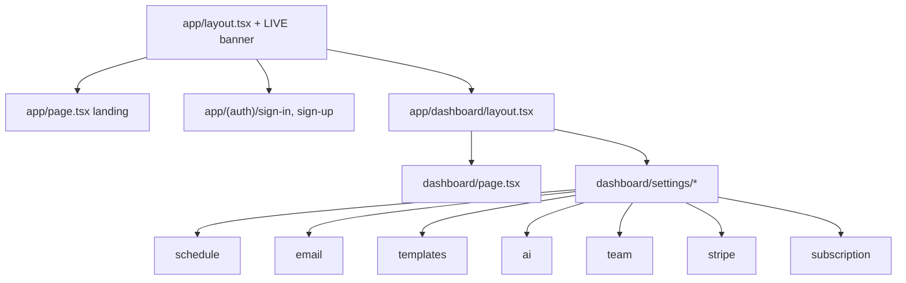

# High Level Design — PaidSoon

> **Repository note.** The generation prompt for this document was written for a
> hypothetical `one-core` Django monorepo with vertical SaaS products
> (ISOComply, RTOComply, etc.), bounded contexts, a workflow engine, an AI
> gateway and a control library. **This repository is not that project.** The
> actual codebase is **PaidSoon** — a single Next.js 16 (App Router) application
> that chases overdue invoices for freelancers. This document describes the
> PaidSoon system as it actually exists. Template sections that have no
> counterpart in the code (Django apps, multi-vertical platform, workflow
> engine, compliance/control library, RAG/vector AI) are explicitly marked
> **Not applicable to this repository** rather than invented.
>
> Source-of-truth order used: (1) current code, (2) `openspec/changes/**`
> (there is no `openspec/specs/**` directory — specs live inside change
> folders), (3) `docs/runbooks/**`, (4) `README.md`.

---

## 1. Executive Summary

PaidSoon is a SaaS application that automatically follows up on overdue invoices
on behalf of freelancers and small businesses. It connects to a user's Stripe
account via **Stripe Connect** (read access to their invoices), detects invoices
that are past their due date, and sends an escalating three-stage email reminder
sequence (friendly → firm → final notice) through **Resend** on a
user-configurable schedule. The product's value proposition is removing the
emotional friction of chasing payment: the freelancer "hides behind" a neutral
automated system (`openspec/changes/invoice-nudge-mvp/proposal.md`).

The platform is monetised through tiered subscriptions (Starter A$9 / Solo A$19 / Small Business A$39 /
Accountant Partner contact-us per month) billed via **Stripe Billing**. Subscription tier
gates feature access and usage limits (number of chased invoices, connected
Stripe accounts, user seats, custom from-address, reminder templates, accounting
integrations, AI rewrite, tone settings)
(`lib/subscriptionPlans.ts`).

**There is no multi-vertical platform.** PaidSoon is a single product, single
tenant-type system (one freelancer = one tenant, keyed by Supabase
`auth.users.id`). There are no organisations, workspaces, teams, RBAC roles,
compliance frameworks, control libraries, or workflow engines in the code.
"Team seats" exist only as a plan limit with a scaffolded, non-persistent invite
endpoint (`app/api/settings/team/invite/route.ts`).

| Aspect | Reality in this repo |
|---|---|
| Product | Single product: overdue-invoice follow-up automation |
| Tenancy | One user = one tenant; isolation via Postgres RLS |
| Frontend + Backend | One Next.js 16 app (App Router); API = route handlers |
| Async processing | Two Vercel Cron jobs → route handlers today (no worker/queue in production yet). A Railway Celery + Redis worker is being introduced to take over scheduled business workflows (dispatcher + queue + retry/backoff) while running in parallel during burn-in — see [migrate-scheduled-jobs-to-railway-celery](../openspec/changes/migrate-scheduled-jobs-to-railway-celery/design.md). Not yet deployed to production. |
| Verticals / RBAC / workflow / control library | **Not present** |

---

## 2. System Context

### Actors and external systems

| Actor / system | Role | Evidence |
|---|---|---|
| Freelancer (end user / "tenant") | Signs up, connects Stripe, configures schedule, views overdue invoices | `app/(auth)/**`, `app/dashboard/**` |
| Operator / developer | Provisions environments, runs migrations, triggers cron manually | `docs/runbooks/**`, `scripts/**` |
| Supabase Auth | External identity provider (email/password + Google OAuth) | `lib/supabase/server.ts`, `app/auth/callback/route.ts` |
| Supabase Postgres | Primary database (also hosts `auth.users`) | `lib/db/admin.ts`, `prisma/schema.prisma` |
| Stripe Connect | Read freelancer invoices; OAuth connection | `app/api/stripe/connect/**`, `lib/providers/stripe.ts` |
| Stripe Billing | Platform subscription billing + customer portal | `app/api/billing/**`, `app/api/webhooks/stripe-billing/route.ts` |
| Resend | Transactional email delivery + sender-domain verification | `lib/email/send.ts`, `app/api/settings/email/route.ts` |
| Xero | Read accounts-receivable invoices and contacts via OAuth 2.0 | `lib/providers/accounting/xero.ts`, `app/api/integrations/xero/**` |
| MYOB Business | Read accounts-receivable invoices and contacts via OAuth 2.0 | `lib/providers/accounting/myob.ts`, `app/api/integrations/myob/**` |
| Vercel | Hosting + Cron scheduler | `vercel.json`, `docs/runbooks/vercel.md` |
| Invoice client (recipient) | Receives reminder emails; not a system user | `lib/email/templates.ts` |

There is **no** dedicated support/helpdesk integration, no object/file storage
provider, and no analytics provider.

### Context diagram

---

## 3. Architecture Overview

PaidSoon is a **single deployable unit**: one Next.js application running on
Vercel. There is no separate backend service, no standalone worker process, no
Redis, and no message queue. "Async processing" is a single HTTP route invoked
by Vercel Cron.

| Concern | Implementation | Status |
|---|---|---|
| Frontend | Next.js 16 App Router, React 19, Tailwind v4 | Implemented |
| Backend API | Next.js route handlers under `app/api/**` | Implemented |
| Server rendering / data fetch | React Server Components (e.g. `app/dashboard/page.tsx`) | Implemented |
| Async / scheduled work | Vercel Cron → `GET /api/cron/send-emails` (daily 09:00 UTC) | Implemented |
| Database | Supabase Postgres via Prisma 7 (`@prisma/adapter-pg`) | Implemented |
| Auth provider | Supabase Auth (email/password + Google OAuth) | Implemented |
| Object storage | **None** — no file/evidence storage in code | N/A |
| Redis / queue | **None** | N/A |
| Billing provider | Stripe Billing (subscriptions + portal) | Implemented |
| Invoice source | Stripe Connect (provider-abstraction layer) | Implemented |
| Email provider | Resend | Implemented |
| AI provider gateway | GPT-4o-mini via Vercel AI SDK (`@ai-sdk/openai`); `lib/email/ai-rewrite.ts` | Implemented |
| CI/CD | **No `.github/workflows/**`** present; deploy via Vercel Git integration | See §10 |
| Environments | Local, Vercel Preview, Production (`docs/runbooks/README.md`) | Implemented (operator-configured) |

---

## 4. Repository and Runtime Topology

Single-package repository (`package.json` `name: "paidsoon"`). No monorepo,
no `apps/*` or `packages/*` workspaces.

| Component | Path | Purpose | Runtime | Notes |
|---|---|---|---|---|
| Web app + API | `app/**` | App Router pages, layouts, API route handlers | Vercel (Node) | SSR + serverless functions |
| Proxy (formerly middleware) | `proxy.ts` | Session refresh, `/dashboard` protection, `LIVE` gating | Vercel Edge/Node proxy | Runs on most paths (see matcher) |
| Domain / service libs | `lib/**` | DB access, billing, email, providers, plans | In-process | No separate service |
| DB admin client | `lib/db/admin.ts` | RLS-bypassing Prisma client | In-process | Cron/webhooks/bootstrap only |
| DB user client | `lib/db/withUserContext.ts` | RLS-enforcing transactional wrapper | In-process | Default for user requests |
| Invoice providers | `lib/providers/**` | Provider abstraction; Stripe implementation | In-process | `stripe` only today |
| Email | `lib/email/**` | Templates, schedule math, send, catch-up scan | In-process | Resend |
| Cron handler | `app/api/cron/send-emails/route.ts` | Catch-up + dispatch sequence | Vercel serverless | Triggered by `vercel.json` cron |
| Prisma schema | `prisma/schema.prisma` | 8 application models | Build/migrate | Generated client → `lib/generated/prisma` |
| RLS policies | `prisma/rls-policies.sql` | Tenant isolation policies (applied manually in Supabase) | Postgres | Not run by `prisma migrate` |
| Generated Prisma client | `lib/generated/prisma/**` | Generated at `prisma generate` (build step) | In-process | Git-ignored output |
| Runbooks | `docs/runbooks/**` | Operator setup (Supabase, Stripe, Resend, Vercel) | Docs | Canonical env-var matrix |
| OpenSpec | `openspec/changes/**` | Change proposals + delta specs | Docs | No `specs/` baseline dir |
| Scripts | `scripts/**` | `verify-rls.ts`, `_loadEnv.ts` | Node (tsx) | RLS verification |
| Tests | `tests/**` | `node --test` unit tests (pure logic) | Node (tsx) | No integration/E2E in repo |

---

## 5. Core Platform Capabilities

The template's capability list (tenants, organisations, RBAC, control library,
obligations, evidence, workflow engine, audit logging, AI gateway, integrations
registry, verticals) mostly **does not exist** here. The table below documents
what is actually present, and explicitly marks absent capabilities.

| Capability | Purpose | Status | Primary code paths | OpenSpec | Notes |
|---|---|---|---|---|---|
| User auth | Account creation, sign-in, session | Implemented | `app/(auth)/**`, `lib/supabase/**`, `app/auth/callback/route.ts` | `changes/invoice-nudge-mvp/specs/user-auth/spec.md` | Supabase Auth; email/pw + Google |
| Tenant isolation | One user = one tenant via RLS | Implemented | `lib/db/withUserContext.ts`, `prisma/rls-policies.sql` | `changes/enforce-rls-via-prisma/specs/user-auth/spec.md` | See §9 |
| Invoice connection | Connect Stripe via OAuth; provider abstraction | Implemented | `app/api/stripe/connect/**`, `lib/providers/**` | `changes/invoice-nudge-mvp/specs/invoice-connection/spec.md` | Stripe only |
| Accounting integrations | Connect Xero/MYOB via OAuth; pull-based invoice sync | Implemented | `app/api/integrations/**`, `lib/providers/accounting/**`, `app/api/cron/sync-accounting/route.ts` | `changes/add-accounting-integrations` | Available on every paid tier; AES-256-GCM token encryption; incremental sync; `AccountingProvider` interface |
| Invoice tracking | Detect & track overdue invoices | Implemented | `lib/email/catchup.ts`, `app/api/webhooks/stripe-connect/route.ts` | `.../specs/invoice-tracking/spec.md` | Webhook + cron catch-up |
| Follow-up sequences | 3-stage escalating reminders | Implemented | `app/api/cron/send-emails/route.ts`, `lib/email/**` | `.../specs/follow-up-sequences/spec.md` | Stages 1/2/3 |
| Schedule config | Per-user day offsets | Implemented | `app/api/settings/schedule/route.ts`, `lib/email/schedule.ts` | `.../specs/schedule-config/spec.md` | Gated to sequence feature |
| Email settings | Custom verified from-address | Implemented | `app/api/settings/email/route.ts`, `lib/email/send.ts` | `.../specs/email-settings/spec.md` | Resend domain verify polling |
| Manual invoice actions | Pause / resume / snooze / resolve | Implemented | `app/api/invoices/[id]/**` | `.../specs/dashboard/spec.md` | RLS-scoped |
| Dashboard | Overdue + resolved views, upsell | Implemented | `app/dashboard/page.tsx`, `components/dashboard/**`, `lib/dashboardUpsell.ts` | `changes/sample-overdue-preview-upsell/specs/...` | Feature-gated modules |
| Billing / entitlements | Tiered plans, checkout, portal, webhooks | Implemented | `app/api/billing/**`, `app/api/webhooks/stripe-billing/route.ts`, `lib/billing.ts`, `lib/subscriptionPlans.ts` | `changes/restore-three-tier-pricing/specs/...` | 4 tiers: Starter A$9 / Solo A$19 / Small Business A$39 (public) / Accountant Partner (contact us, hidden) |
| Live-mode gating | Pre-launch auth lockout + banner | Implemented | `lib/liveMode.ts`, `proxy.ts`, `app/layout.tsx` | `changes/live-mode-auth-gate-banner/specs/...` | `LIVE` env var |
| Templates | Read/write per-stage reminder templates | Implemented | `app/api/settings/templates/route.ts` | `changes/ai-message-rewrite`, `changes/templates-sidebar-help` | GET/PUT/DELETE; persists to `email_templates`; sidebar with variable chips |
| AI rewrite | GPT-4o-mini rewrite of reminder text | Implemented | `app/api/settings/ai/route.ts`, `lib/email/ai-rewrite.ts` | `changes/ai-message-rewrite` | Three tone variants; usage logged; embedded in templates page |
| Subscription plan switching | Upgrade mid-cycle; deferred downgrade | Implemented | `app/api/billing/{checkout,downgrade}/route.ts` | `changes/subscription-plan-switching` | Upgrade via Stripe sub update; downgrade via Stripe Schedule |
| Team seats / invites | Invite teammates | **Scaffold only** | `app/api/settings/team/invite/route.ts` | — | Limit-checked; no membership model/persistence |
| Payment-failed handling | Mark `past_due` on failed charge | **Proposed, not implemented** | (would be `app/api/webhooks/stripe-billing/route.ts`) | `changes/handle-billing-payment-failed-webhook/proposal.md` | No `invoice.payment_failed` case in code |
| Env-var drift CI check | Assert runbook matrix matches code | **Proposed, not implemented** | (would be `scripts/check-runbook-envvars.ts`) | `changes/ci-runbook-envvar-drift-check/proposal.md` | No script, no CI workflow |
| Organisations / workspaces | Multi-tenant org model | **Not applicable** | — | — | No such model |
| RBAC / roles | Role-based access control | **Not applicable** | — | — | No roles; only plan tiers |
| Compliance / control library / obligations / evidence | Compliance platform | **Not applicable** | — | — | Not this product |
| Workflow engine | Definitions/instances/nodes/tasks | **Not applicable** | — | — | The only "workflow" is the 3-stage email sequence |
| Audit logging | Structured audit events | **Not present** | — | — | `email_logs` is the only persistent event trail |
| Internal admin / platform settings | Operator console | **Not present** | — | — | Operators use Supabase/Stripe/Vercel dashboards |

---

## 6. Data Architecture

### Stores

| Store | Provider | Contents | Tenant scoping |
|---|---|---|---|
| Application DB | Supabase Postgres | 6 app tables (`prisma/schema.prisma`) | Postgres RLS on `userId` |
| Identity store | Supabase `auth.users` (managed) | User accounts, metadata | Supabase-managed |
| Object/file storage | **None** | — | — |
| Audit/event store | `email_logs` table (send trail only) | Per-send log rows | RLS via join to `tracked_invoices` |
| Reporting/export store | **None** | — | — |

`userId` on every application row is the Supabase `auth.users.id` (a string).
There is no separate `Organisation`/`Tenant` table — the tenant boundary **is**
the user id.

### High-level ERD

---

## 7. API Architecture

All APIs are Next.js App Router **route handlers** colocated under `app/api/**`.
There is no separate API service, no API versioning, and no OpenAPI/GraphQL
layer. There is no BFF separation — the same Next.js app serves UI and API.

- **Authentication model:** Supabase session cookies via `@supabase/ssr`.
  User-facing handlers call `supabase.auth.getUser()` and reject with 401 if
  absent (`app/api/billing/checkout/route.ts`). Webhooks authenticate by Stripe
  signature. The cron route authenticates via `Authorization: Bearer
  ${CRON_SECRET}`.
- **Tenant resolution:** the authenticated `user.id` is passed to
  `withUserContext(user.id, …)`, which sets the Postgres JWT claim and switches
  role so RLS scopes the query. There is no tenant header or subdomain.
- **No public/unauthenticated tenant API** beyond webhooks and the landing page.

| Route prefix | Owning module | Purpose | Auth | Status |
|---|---|---|---|---|
| `app/api/billing/checkout` | Billing | Create Stripe Checkout session | Supabase session | Implemented |
| `app/api/billing/portal` | Billing | Stripe customer portal link | Supabase session | Implemented |
| `app/api/stripe/connect/authorize` | Invoice connection | Begin Stripe Connect OAuth | Supabase session | Implemented |
| `app/api/stripe/connect/callback` | Invoice connection | OAuth callback, store account | Supabase session + `state==user.id` | Implemented |
| `app/api/stripe/connect/disconnect` | Invoice connection | Deactivate connection | Supabase session | Implemented |
| `app/api/webhooks/stripe-billing` | Billing | Subscription lifecycle | Stripe signature | Implemented (no `payment_failed`) |
| `app/api/webhooks/stripe-connect` | Invoice tracking | `invoice.overdue` / `invoice.paid` | Stripe signature | Implemented |
| `app/api/cron/send-emails` | Sequence engine | Catch-up + dispatch | `Bearer CRON_SECRET` | Implemented |
| `app/api/invoices/[id]/{pause,resume,snooze,resolve}` | Dashboard actions | Manual state changes | Supabase session + RLS | Implemented |
| `app/api/settings/schedule` | Schedule config | GET/PUT day offsets | Supabase session + feature gate | Implemented |
| `app/api/settings/email` | Email settings | GET/PUT custom sender | Supabase session + feature gate | Implemented |
| `app/api/settings/templates` | Templates | GET list / PUT custom | Supabase session + feature gate | GET impl; PUT scaffold |
| `app/api/settings/ai` | AI rewrite | GET caps / POST rewrite | Supabase session + feature gate | Stub (placeholder text) |
| `app/api/settings/team/invite` | Team seats | GET seats / POST invite | Supabase session | Scaffold (no persistence) |

There are **no deprecated API aliases** in the code. The only legacy-compat
surface is the `STRIPE_PRO_PRICE_ID` env var, accepted as a fallback for the
`solo` tier price (`app/api/billing/checkout/route.ts`).

---

## 8. Frontend Architecture

- **Framework:** Next.js 16 App Router with React 19 Server Components by
  default; client components opt in with `"use client"`
  (`components/settings/*Client.tsx`).
- **Routing:** route groups `app/(auth)/**` (sign-in/up) and protected
  `app/dashboard/**` with nested `settings/**` pages.
- **No frontend packages / design system library** — Tailwind v4 utility
  classes inline; a single shared `components/ui/Spinner.tsx`.
- **Auth/session:** `lib/supabase/server.ts` (RSC/route handler client, cookie
  bridge) and `lib/supabase/client.ts` (browser client). Session refresh and
  route protection are centralised in `proxy.ts`.
- **Tenant context:** implicit — the signed-in `user.id`; no tenant switcher.
- **Branding/theming:** single brand "PaidSoon" (`app/layout.tsx`); no
  per-vertical theming.
- **Dashboard:** `app/dashboard/page.tsx` renders overdue/resolved tables
  (`components/dashboard/InvoiceTable.tsx`) and gated upsell previews
  (`LockedDashboardPreview.tsx`, `UpgradeBanner.tsx`) driven by
  `lib/dashboardUpsell.ts`.
- **Admin pages:** none.

---

## 9. Security Architecture

| Control | Implementation | Status |
|---|---|---|
| Authentication | Supabase Auth (email/pw + Google OAuth); cookie sessions via `@supabase/ssr` | Implemented |
| Route protection | `proxy.ts` redirects unauthenticated `/dashboard/*` to `/sign-in` | Implemented |
| Authorization | **Plan-tier feature gates only** (`requireFeature`, `lib/billing.ts`). No RBAC roles | Implemented (coarse) |
| Tenant isolation | Postgres RLS; `withUserContext` sets `request.jwt.claims` + `SET LOCAL ROLE authenticated` per transaction | Implemented |
| Cross-tenant enforcement | RLS policies key every table on `auth.uid()::text = "userId"` (`prisma/rls-policies.sql`); verified by `scripts/verify-rls.ts` | Implemented |
| Privileged DB access | `prismaAdmin` bypasses RLS; restricted by convention to cron/webhooks/bootstrap and grep-able | Implemented (convention-enforced) |
| Webhook authenticity | Stripe signature verification (billing + connect) | Implemented |
| Cron authenticity | `Authorization: Bearer ${CRON_SECRET}` | Implemented |
| OAuth CSRF | Stripe Connect `state` parameter validated against `user.id` in callback | Implemented |
| Secrets management | Environment variables (Vercel env + `.env.local`); canonical matrix in `docs/runbooks/README.md` | Implemented |
| Encryption at rest/in transit | Delegated to Supabase/Stripe/Vercel/Resend managed platforms | Assumed (platform-provided) |
| Field-level encryption | Schema comment says `stripeConnectAccountId` is "encrypted at app layer" but **no encryption code exists** | **Gap** |
| Audit trail | `email_logs` only; no security/audit event log | Partial |
| AI safety / policy | **No AI calls made**; rewrite endpoint is a placeholder | N/A |
| File/evidence security | No file storage | N/A |
| Rate limiting / abuse protection | **None in code** | **Gap** |

> **Notable security gap.** `prisma/schema.prisma` comments
> `stripeConnectAccountId  // encrypted at app layer`, but
> `app/api/stripe/connect/callback/route.ts` stores the raw account id with no
> encryption. The comment overstates the implemented control.

---

## 10. Infrastructure and Deployment

This section reflects only what the repository proves. **No AWS, Terraform,
App Runner, RDS, SES, or Cognito infrastructure exists in this repo** — those
terms appear nowhere in the code and must not be treated as part of this system.

| Concern | Actual configuration | Evidence |
|---|---|---|
| Frontend + API hosting | Vercel (single Next.js deployment) | `docs/runbooks/vercel.md`, `vercel.json` |
| Worker hosting | None in production yet — cron invokes a route on the same deployment. A Railway Celery worker/Beat/Redis stack is scaffolded (`worker/`) and intended to take over, running in parallel during burn-in before the Vercel crons it replaces are removed. | `vercel.json` crons, `worker/`, [migrate-scheduled-jobs-to-railway-celery](../openspec/changes/migrate-scheduled-jobs-to-railway-celery/design.md) |
| Scheduler | Vercel Cron: `0 9 * * *` → `/api/cron/send-emails`, `0 2 * * *` → `/api/cron/sync-accounting`, `0 12 * * *` → `/api/cron/scheduling-watchdog` | `vercel.json` |
| Database | Supabase Postgres (`paidsoon-dev`, `paidsoon-prod`) | `docs/runbooks/supabase.md` |
| DB connections | `DATABASE_URL` (shared pooler, `postgres.[ref]`, RLS applied by `withUserContext`'s `SET LOCAL ROLE authenticated`) + `DIRECT_URL` (owner, migrations) | `prisma.config.ts`, `lib/db/admin.ts` |
| Auth | Supabase Auth | `docs/runbooks/supabase.md` |
| Object storage | None | — |
| Redis / queue | None | — |
| Billing | Stripe (Connect + Billing) | `docs/runbooks/stripe.md` |
| Email | Resend | `docs/runbooks/resend.md` |
| DNS / domain | `paidsoon.com` (prod); legacy `invoicenudge.com` to be retired | `docs/runbooks/README.md`, `changes/go-live-runbook/proposal.md` |
| CI/CD | **No `.github/workflows/**`.** Deploys via Vercel Git integration | (file tree) |
| Environments | Local, Vercel Preview (shares `paidsoon-dev` + Stripe test), Production | `docs/runbooks/README.md` |
| Env promotion | Manual per-environment Vercel env vars; cron only fires in Production | `docs/runbooks/README.md`, `docs/runbooks/vercel.md` |

> **Stale-docs note.** There is no archived AWS/Terraform material in this
> repository. If any external document references App Runner, RDS Multi-AZ, SES,
> or Cognito for PaidSoon, it is incorrect for this codebase.

---

## 11. Observability and Operations

| Area | Implementation | Status |
|---|---|---|
| Logging | `console.error` in catch-up scan, email send, cron paths | Minimal |
| Structured logs / tracing | None | Gap |
| Email send trail | `email_logs` rows (stage, Resend message id, from, subject) | Implemented |
| Health checks | None (no `/health` route) | Gap |
| Admin dashboards | External: Supabase, Stripe, Vercel, Resend consoles | Implemented (external) |
| Runbooks | `docs/runbooks/{README,supabase,stripe,resend,vercel}.md` | Implemented |
| Backup / restore | Delegated to Supabase managed backups (not documented in repo) | Assumed |
| Local development | `npm install` → `vercel env pull` → `npm run dev` | Implemented (`README.md`) |
| Smoke / readiness | `scripts/verify-rls.ts` (RLS isolation proof); manual E2E checklist | Implemented (`changes/go-live-runbook`) |
| Cron testing | Manual `curl` with `CRON_SECRET` (cron does not fire on Preview) | `docs/runbooks/vercel.md` |

---

## 12. Non-Functional Requirements

| NFR | Current state | Status |
|---|---|---|
| Security | RLS tenant isolation; webhook/cron auth; secret-via-env | Partially implemented |
| Tenant isolation | DB-enforced via RLS + verification script | Implemented |
| Availability | Inherited from Vercel + Supabase managed SLAs | Assumed (platform) |
| Scalability | Serverless functions scale horizontally; cron is a single sequential loop over all due invoices | Partially implemented (cron not parallelised/paginated) |
| Performance | Per-request RLS transaction overhead; no caching layer | Assumed adequate at MVP scale |
| Privacy | Client emails/names stored; no PII minimisation/retention policy in code | Specified-only |
| Compliance readiness | No formal compliance controls (this is not a compliance product) | N/A |
| Maintainability | Small, typed, single-package; clear lib boundaries; unit tests for pure logic | Implemented |
| Cost control | Single Vercel + Supabase + Resend + Stripe footprint | Assumed |
| AI cost governance | No AI spend (no provider wired) | N/A |
| Disaster recovery | Relies on Supabase backups; no documented RPO/RTO | Assumed/gap |

---

## 13. Architecture Decisions

There is **no `docs/adr/**` directory** in this repository. Architectural
decisions are recorded informally inside OpenSpec change `design.md` files. The
most consequential implicit decisions:

| ID | Decision | Status | Relevance | Source |
|---|---|---|---|---|
| (no ADR dir) | Enforce tenant isolation via Postgres RLS + `withUserContext`, not app-level `where` clauses | Active | Core security model | `changes/enforce-rls-via-prisma/design.md`, `lib/db/withUserContext.ts` |
| (no ADR dir) | Two Prisma entry points (`withUserContext` vs `prismaAdmin`); no default `prisma` export | Active | Prevents accidental RLS bypass | `lib/db/admin.ts`, `README.md` |
| (no ADR dir) | Provider abstraction for invoice sources (Stripe first) | Active | Future provider support | `lib/providers/types.ts` |
| (no ADR dir) | `LIVE` env flag gates auth entry pre-launch | Active | Controlled rollout | `changes/live-mode-auth-gate-banner/design.md` |
| (no ADR dir) | Two DB URLs: pooled non-owner runtime + direct owner for migrations | Active | Makes RLS fire under Prisma | `prisma.config.ts` |

**Suggested missing ADRs:** (1) record the RLS-via-Prisma decision formally;
(2) decide and document the encryption-at-app-layer claim for
`stripeConnectAccountId`; (3) decide cron scalability strategy (pagination /
batching) before invoice volume grows.

---

## 14. Spec Alignment Gaps

| Area | Source of truth | Gap | Risk | Recommended follow-up |
|---|---|---|---|---|
| Subscription tier default | Code | **Resolved by `changes/restore-three-tier-pricing`** — `prisma/schema.prisma` now defaults `subscriptionTier` to `"starter"`, matching `lib/subscriptionPlans.ts` | Resolved | n/a |
| Subscription tier rename migration | Code | **Resolved by `changes/restore-three-tier-pricing`** — a migration normalises any stray `subscriptionTier` values (e.g. `business`) to the current tier set | Resolved | n/a |
| New pricing features not in code | Pricing page | **Partially resolved** — `weekly_summary_email` is now implemented and shown where enabled; the remaining unimplemented capabilities (`csv_export`, `approval_mode`, `contact_suppression`, `team_seats`, `customer_specific_sequences`, `multi_template_customer_wording`, `multi_client_management`) stay tracked via `UNIMPLEMENTED_FEATURES`/`isFeatureImplemented()` and continue to render as "Coming soon" where applicable; `promise_to_pay_tracking` remains implemented and enabled on every paid tier | In progress | n/a |
| `STRIPE_BUSINESS_PRICE_ID` env var | Code | **Resolved by `changes/restore-three-tier-pricing`** — `STRIPE_BUSINESS_PRICE_ID` and `STRIPE_PRO_PRICE_ID` have been retired; the canonical set is `STRIPE_STARTER_PRICE_ID` / `STRIPE_SOLO_PRICE_ID` / `STRIPE_SMALL_BUSINESS_PRICE_ID` | Resolved | n/a |
| `stripeConnectAccountId` encryption | Code | Schema comment claims app-layer encryption; no code encrypts it | Medium — overstated security control | Implement encryption or correct the comment |
| `invoice.payment_failed` | OpenSpec | Listed as required webhook event; no handler in code | Medium — `past_due` not reflected promptly | Implement `changes/handle-billing-payment-failed-webhook` |
| Env-var drift CI | OpenSpec | Proposed CI check + script not present; no CI workflow at all | Medium — runbook/code drift recurs | Implement `changes/ci-runbook-envvar-drift-check` + add CI |
| Custom templates | Code | PUT endpoint returns payload but does not persist (no model) | Low — feature appears available but is inert | Add template model or hide UI until built |
| AI rewrite | Code | Endpoint returns `` `[tone] text` `` placeholder; no AI provider | Medium — feature implies AI that does not exist | Wire a provider or relabel as roadmap |
| Team seats | Code | Invite endpoint scaffolded, no membership model | Low — seats unusable | Build team model or mark as future |
| OpenSpec baseline | OpenSpec | No `openspec/specs/**`; specs live only inside change folders, never archived | Low — harder to see "current" spec | Run OpenSpec archive to establish a spec baseline |

---

## 15. Glossary

| Term | Meaning |
|---|---|
| Tenant | A single freelancer user, identified by Supabase `auth.users.id`; the isolation boundary |
| RLS | Postgres Row Level Security; enforces per-user data access |
| `withUserContext` | Helper that runs Prisma queries inside an RLS-enforcing transaction (`lib/db/withUserContext.ts`) |
| `prismaAdmin` | RLS-bypassing Prisma client for service paths (`lib/db/admin.ts`) |
| Tracked invoice | A `TrackedInvoice` row representing an overdue invoice being chased |
| Stage | The reminder step (1 friendly → 2 firm → 3 final) for a tracked invoice |
| Catch-up scan | Cron-time poll of Stripe for newly overdue invoices (`lib/email/catchup.ts`) |
| Connection | A linked Stripe Connect account (`InvoiceConnection`) supplying invoices |
| Tier / plan | Subscription level (Starter / Solo / Small Business / Accountant Partner) gating features and limits |
| `LIVE` | Env flag controlling pre-launch auth gating (`lib/liveMode.ts`) |
| Provider | Invoice-source adapter implementing `InvoiceProvider` (`lib/providers/types.ts`) |
